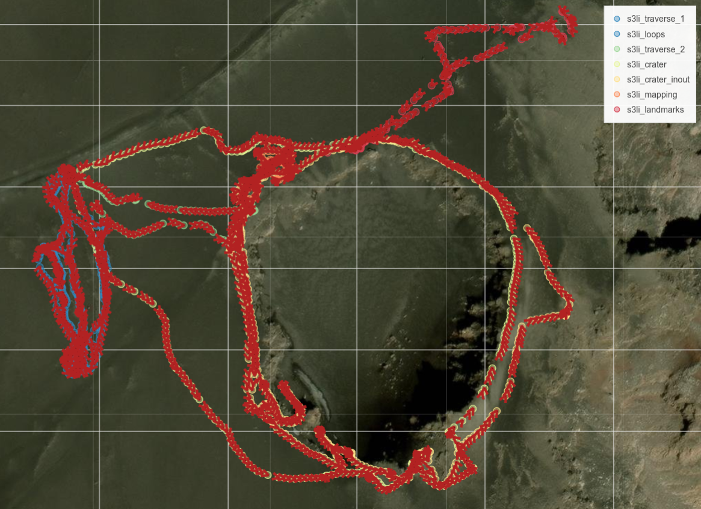
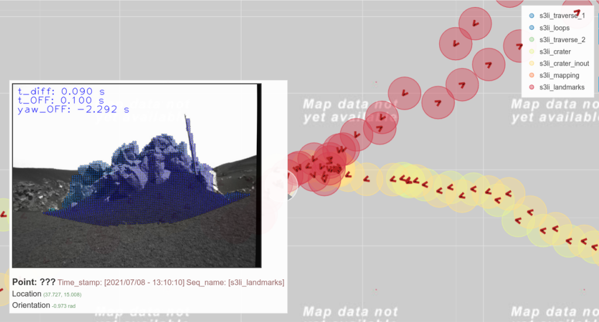
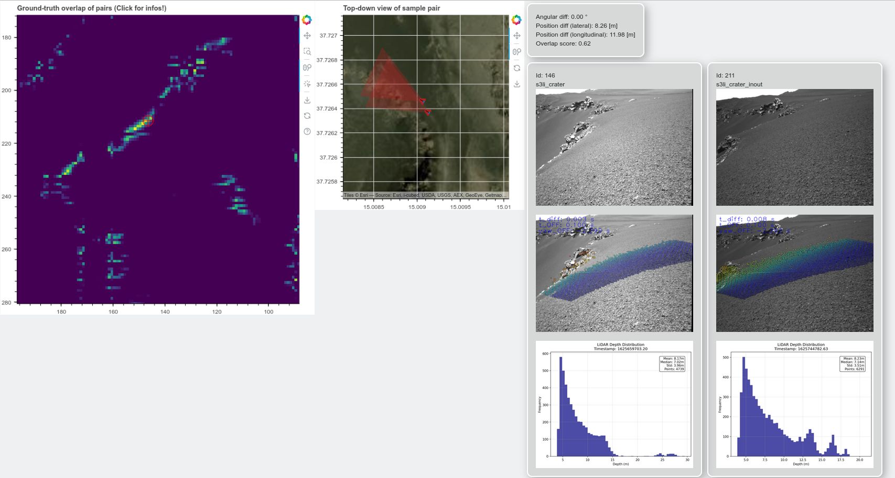

# S3LI Interface
This package provides useful tools and scripts for playback and preparation of the  S3LI dataset. 

Links: 
- https://datasets.arches-projekt.de/s3li_dataset/
- https://ieeexplore.ieee.org/document/9813579

If you find this package useful for your work, consider to cite 
```
@ARTICLE{9813579,
  author={Giubilato, Riccardo and Stürzl, Wolfgang and Wedler, Armin and Triebel, Rudolph},
  journal={IEEE Robotics and Automation Letters}, 
  title={Challenges of SLAM in Extremely Unstructured Environments: The DLR Planetary Stereo, Solid-State LiDAR, Inertial Dataset}, 
  year={2022},
  volume={7},
  number={4},
  pages={8721-8728},
  doi={10.1109/LRA.2022.3188118}
}

```

## Generation of train and test datasets for place recognition
The package provides two scripts to scrim the bagfiles and generate datasets with synchronized tuples of:
$$(I_{left}, L, p_{D-GNSS}, \phi_{north})$$
with $I_{left}$ the left camera image, $L$ a lidar scan, $p_{D-GNSS}$ the ground truth position in global coordinates, measured with a differential GNSS setup, and $\phi_{north}$ the orientation of the camera to the north.

### 1. Preparation
Download the dataset :) ()

### 2. Set-Up
This code was tested using Python 3.9.21 and ROS1 Melodic on openSUSE Leap 15.5. To start, clone the repository and then use the provided requirements.txt to install the dependencies:

`pip install -r requirements.txt`

### 3. Pre-processing step: SLAM evaluation data to pickle
As the D-GNSS setup did not measure orientation of the camera, we approximate it using the results from the evaluated visual-inertial SLAM/Odometry algorithms. The idea is that, after aligning trajectories and camera poses to the D-GNSS ground truth, transformed into metric coordinates for an arbitrary ENU frame, the pose estimation should be accurate enough to provide a very good guess of the real orientatio of the cameras. Therefore, we can use this information to better discern between positive and negative samples for place recognition. 

The script `slam_poses_to_pandas.py` reads the output `.txt` files from the `Eval` folder, and transforms them into a pandas dataframe. The dataframe will contain SLAM/VO results in the following tabular form: 

| Timestamp       | Rotation                       | Position  |
| --------        | -------                        |-------    |
| posix_time [s]  | Quaternion **(w, x, y, z)**    | [x, y, z] |

Usage:
1) From the root package folder: ```python3 scripts/slam_poses_to_pandas.py ${path_to_s3li_dataset_root} ${which_algorithm}``` (e.g., ```python3 scripts/slam_poses_to_pandas.py /home_local/giub_ri/s3li_dataset BASALT_STEREO_INERTIAL```)
2) This will write pickle files in a folder names `processed` from the root dataset path

### 4. Sample Generation
This step foresees the generation of all data samples for each sequence. The script `create_dataset.py` reads the content of all bagfiles in the `Bagfile` folder, and associates data from the various topics, writing links and data into a pandas dataframe, then stored as a pickle to disk. 
In this step, the results of SLAM evaluations, pre-processed in Sec.2, are used to approximate an orientation (with respect to the North) for each image/scan pair, as the ground truth is only from D-GNSS without magnetometer or full RTK. To account for the yaw-drift, which is inevitable in the context of V-SLAM, camera trajectories are split in an user-defined manner (default is 3 splits) and independently aligned to the ground truth (x, y, z in ENU frame). The corresponding rotation is applied to the camera poses, and the northing is stored.

Usage: 
1) From the package root: ```python3 scripts/create_dataset.py ${path_to_s3li_dataset_root} ${camera_config}``` (e.g. ```python3 scripts/create_dataset.py /home_local/giub_ri/s3li_dataset/ cfg/cam0_pinhole.yaml```)

### 5. Lidar Histograms Generation
This script `create_lidar_histograms.py` processes LiDAR point cloud data stored in the pickle files and generates histograms representing the distribution of depth (Z-axis) values. The generated histograms will later be used in the visualization of the interactive plot.

Usage:
1) From the package root:```python3 scripts/create_lidar_histograms.py ${path_to_s3li_dataset_root}```
`
### 6. Visualization
The results can be qualitatively inspected using the provided script `make_maps_in_bokeh.py`, which overlays subsampled images (with LiDAR point projections) on geo-references positions in an interactive map. 

Usage: 
1) From the package root: ```python3 scripts/make_maps_in_bokeh.py ${path_to_s3li_dataset_root}/dataset/ ${skip}```

This will look in the dataset folders for saved pickles, that contain a dataframe for each entire bagfile, and create an interactive Bokeh plot showing the global position and orientation of collected image/scan samples and pre-vieweing the image with lidar overlay when hovering with the mouse cursor. 

Example Bokeh plot, full view: 


Detail of the Bokeh plot, with data preview: 


### 7. Interactive plot
Visual analysis interactive tool for camera overlap. 
The script `interactive_overlap_maps.py` calculates the overlap between different camera views using two possible methods:

- An angle-based approach (compute_overlap_v1)
- A polygon intersection approach (compute_overlap_v2)

In addition, it considers occlusion detection by analyzing LiDAR depth data to adjust camera field-of-view ranges.

Usage:
1) From the package root: ```python3 scripts/interactive_overlap_maps.py  ${path_to_s3li_dataset_root}/dataset/ ${skip} ${compute_overlap_version}``` (e.g. ```python3 scripts/interactive_overlap_maps.py /home_local/enci_la/Etna/dataset/ 50 2```)

Example Bokeh plot:

